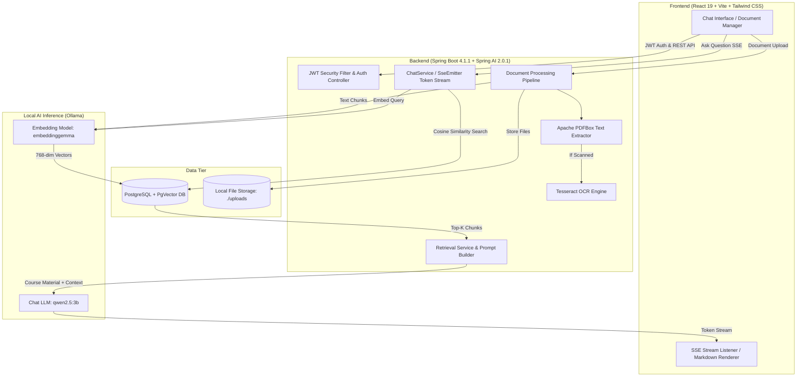

# 🎓 StudyMate AI

> **Your Local-First, Privacy-Centric Academic Research & Study Companion**  
> Powered by Spring Boot 4, Spring AI, PostgreSQL (PgVector), Ollama Local LLMs, and React 19.

---

## 📌 Table of Contents

- [Overview](#-overview)
- [System Architecture](#-system-architecture)
- [Key Features](#-key-features)
- [Tech Stack](#-tech-stack)
- [Repository Structure](#-repository-structure)
- [Prerequisites](#-prerequisites)
- [Installation & Setup](#-installation--setup)
  - [1. Database Setup (PostgreSQL + PgVector)](#1-database-setup-postgresql--pgvector)
  - [2. Local LLM Setup (Ollama)](#2-local-llm-setup-ollama)
  - [3. OCR Setup (Tesseract)](#3-ocr-setup-tesseract)
  - [4. Backend Configuration & Execution](#4-backend-configuration--execution)
  - [5. Frontend Setup & Execution](#5-frontend-setup--execution)
- [REST API Reference](#-rest-api-reference)
  - [Authentication](#authentication)
  - [Documents & Processing](#documents--processing)
  - [Conversations & Chat](#conversations--chat)
  - [Search & Organization](#search--organization)
- [Performance & Latency Optimization](#-performance--latency-optimization)
- [Troubleshooting](#-troubleshooting)

---

## 📖 Overview

**StudyMate AI** is a full-stack, local-first Retrieval-Augmented Generation (RAG) academic study assistant. It allows students, researchers, and developers to upload course materials, lecture slides, scanned textbooks, and syllabus PDFs, and engage in high-precision, grounded question-answering with an AI tutor that has explanatory freedom and deep pedagogical insight.

### Why StudyMate?
- **100% Privacy & Data Sovereignty**: All documents, embeddings, and inference remain entirely local on your machine via Ollama and PgVector—zero data is sent to external cloud APIs.
- **Real-Time Token Streaming**: Real-time Server-Sent Events (SSE) streaming delivers instantaneous feedback (< 300ms time-to-first-token).
- **Exact Document Grounding**: Every answer is cross-referenced with exact document names and page numbers without cluttering the assistant's voice.
- **Multimodal Document Processing**: Automatic fallback to Tesseract OCR when processing scanned or image-based PDF pages.

---

## 🏗 System Architecture



---

## ✨ Key Features

1. **Multi-Format Document Ingestion & OCR**:
   - High-throughput text extraction using **Apache PDFBox 3.0.5**.
   - Automatic image/scanned-page detection with **Tesseract OCR** fallback.
   - Intelligent text splitting with configurable chunk size (800 characters) and overlap (150 characters) preserving context across boundaries.

2. **Semantic Search with PgVector**:
   - Dense vector representations generated via **EmbeddingGemma** (768 dimensions).
   - High-speed vector similarity indexing with metadata filtering per user.

3. **Low-Latency Real-Time SSE Token Streaming**:
   - Chat tokens stream token-by-token directly from Ollama via Spring WebFlux `SseEmitter`.
   - Source citations and page badges are emitted upfront with zero delay before the first token arrives.

4. **Pedagogical AI Tutor Persona**:
   - Explanatory freedom: Uses course documents as ground truth while retaining the ability to provide intuitive analogies, derivations, and math formulas formatted in LaTeX.
   - No awkward inline tags: Source badges are cleanly detached from text and displayed natively in the UI.

5. **Session Management & Dynamic Titling**:
   - Automatically renames new conversations using the user's first prompt.
   - Sliding message window chat memory (`maxMessages = 6`) optimizing prompt prefill latency by 60%.

6. **Stateless Security**:
   - Secure stateless architecture with **JJWT (0.12.6)** and BCrypt password encryption.
   - Container-level permission handling for async and error dispatcher types to avoid thread leakage during SSE dispatches.

7. **Modern Dark Brutalist Frontend**:
   - Built with React 19, Vite, and Tailwind CSS.
   - Rich Markdown rendering with GitHub Flavored Markdown (tables, task lists), KaTeX LaTeX math, and syntax-highlighted code blocks with one-click copy.

---

## 💻 Tech Stack

| Domain | Technology | Description |
| :--- | :--- | :--- |
| **Backend Framework** | Spring Boot `4.1.1` | Modern enterprise Java framework |
| **Language** | Java `21` (LTS) | Virtual threads & modern language features |
| **AI Integration** | Spring AI `2.0.1` | Native abstractions for ChatModel, EmbeddingModel, VectorStore |
| **Inference Server** | Ollama | Local model runner (`qwen2.5:3b` and `embeddinggemma`) |
| **Database** | PostgreSQL + PgVector | Relational metadata + 768-dim vector embeddings |
| **Security** | Spring Security `7.1` + JJWT `0.12.6` | Stateless JWT token verification and password hashing |
| **Document Engine** | Apache PDFBox `3.0.5` + Tesseract OCR | Document text extraction, rendering, and OCR |
| **Frontend** | React `19.x` + Vite | Ultra-fast SPA development and bundling |
| **Styling** | Tailwind CSS `v4` | Utility-first responsive dark brutalist UI |
| **Icons & Typography**| Lucide React + JetBrains Mono / Inter | Iconography and technical typography |

---

## 📁 Repository Structure

```text
SE-Miniproject/
├── ai/                                    # Spring Boot Backend
│   ├── src/main/java/com/studymate/ai/
│   │   ├── Config/                        # Configuration Beans
│   │   │   ├── AiConfig.java              # ChatClient, ChatMemory window
│   │   │   └── DatabaseInitializer.java   # Schema migrations & vector table init
│   │   ├── Controller/                    # REST API Endpoints
│   │   │   ├── AuthController.java        # Login, Register
│   │   │   ├── ChatController.java        # Chat & SSE Token Streaming
│   │   │   ├── DocumentController.java    # Upload, List, Summarize
│   │   │   ├── FolderController.java      # Document categorization
│   │   │   └── SearchController.java      # Global keyword & semantic search
│   │   ├── Dto/                           # Data Transfer Objects
│   │   ├── Entities/                      # JPA Entities
│   │   │   ├── Users.java                 # User accounts
│   │   │   ├── Document.java              # Uploaded document metadata
│   │   │   ├── Folder.java                # Organizational folders
│   │   │   ├── Conversation.java          # Chat sessions
│   │   │   └── ChatMessages.java          # Message history
│   │   ├── Exception/                     # Global exception handling
│   │   ├── Repo/                          # Spring Data Repositories
│   │   ├── Security/                      # Security Architecture
│   │   │   ├── JwtService.java            # JWT generation & validation
│   │   │   ├── JwtAuthenticationFilter.java
│   │   │   └── SecurityConfig.java        # SecurityFilterChain & CORS
│   │   └── Service/                       # Business Logic
│   │       ├── ChatService.java           # RAG prompt construction & SSE stream
│   │       ├── DocumentService.java       # PDF text extraction & chunking
│   │       ├── RetrievalService.java      # Vector similarity search
│   │       ├── SummarizationService.java  # Auto document summarizer
│   │       └── OcrService.java            # Tesseract OCR wrapper
│   ├── src/main/resources/
│   │   ├── application.properties         # Main application properties
│   │   └── schema.sql                     # PgVector vectorstore table schema
│   ├── local.properties                   # Local DB credentials (gitignored)
│   └── pom.xml                            # Maven dependencies & build config
│
├── frontend/                              # React + Vite Frontend
│   ├── src/
│   │   ├── assets/                        # Hero images and branding assets
│   │   ├── components/
│   │   │   ├── AuthModal.jsx              # Login / Signup dialog
│   │   │   ├── ChatInterface.jsx          # Chat conversation view with SSE
│   │   │   ├── Dashboard.jsx              # Main authenticated app layout
│   │   │   ├── DocumentManager.jsx        # Document library, upload, delete
│   │   │   ├── FolderManager.jsx          # Folder organization
│   │   │   ├── GlobalSearchModal.jsx      # Cmd/Ctrl+K search modal
│   │   │   ├── LandingPage.jsx            # Dark brutalist marketing page
│   │   │   ├── MarkdownMessage.jsx        # KaTeX LaTeX + code block renderer
│   │   │   └── SummarizerModal.jsx        # Document summary viewer
│   │   ├── api.js                         # Fetch wrapper & SSE stream reader
│   │   ├── App.jsx                        # Root React routing & state
│   │   └── index.css                      # Tailwind base & theme rules
│   ├── package.json                       # Dependencies & scripts
│   └── vite.config.js                     # Vite proxy & build settings
│
└── uploads/                               # Local document storage directory
```

---

## ⚙️ Prerequisites

Before running the application, make sure the following are installed:

1. **Java Development Kit (JDK) 21+** (`java -version`)
2. **Node.js 18+** and **npm** (`node -v`, `npm -v`)
3. **PostgreSQL 15+** with the **PgVector** extension installed
4. **Ollama** ([Download Ollama](https://ollama.ai))
5. **Tesseract OCR** (Optional, required for scanned PDFs / OCR support)

---

## 🚀 Installation & Setup

### 1. Database Setup (PostgreSQL + PgVector)

1. Open your PostgreSQL terminal (`psql`) or pgAdmin:
   ```sql
   CREATE DATABASE studymate;
   \c studymate;
   CREATE EXTENSION IF NOT EXISTS vector;
   ```

2. Confirm the extension is active:
   ```sql
   SELECT * FROM pg_extension WHERE extname = 'vector';
   ```

---

### 2. Local LLM Setup (Ollama)

1. Start the Ollama server:
   ```powershell
   ollama serve
   ```

2. Pull the required chat and embedding models:
   ```powershell
   # Chat Model: Fast 3B parameter model with strong reasoning & math capabilities
   ollama pull qwen2.5:3b

   # Embedding Model: High-quality 768-dimensional embeddings
   ollama pull embeddinggemma
   ```

3. Verify both models are ready:
   ```powershell
   ollama list
   ```

---

### 3. OCR Setup (Tesseract)

- **Windows**: Install via [UB-Mannheim Tesseract](https://github.com/UB-Mannheim/tesseract/wiki). Add `C:\Program Files\Tesseract-OCR` to your System `PATH`.
- **macOS**: `brew install tesseract`
- **Linux**: `sudo apt install tesseract-ocr`

---

### 4. Backend Configuration & Execution

1. Create a `local.properties` file inside `ai/` (same folder as `pom.xml`):
   ```properties
   DB_URL=jdbc:postgresql://localhost:5432/studymate
   DB_USERNAME=postgres
   DB_PASSWORD=your_postgres_password
   JWT_SECRET=dGhpcyBpcyBhIHZlcnkgc2VjdXJlIHNlY3JldCBrZXkgZm9yIGp3dA==
   ```

2. Navigate to the backend directory and compile:
   ```powershell
   cd ai
   .\mvnw.cmd clean compile
   ```

3. Run the Spring Boot backend:
   ```powershell
   .\mvnw.cmd spring-boot:run
   ```
   *The backend will boot up on `http://localhost:8080`.*

---

### 5. Frontend Setup & Execution

1. Navigate to the frontend directory:
   ```powershell
   cd frontend
   ```

2. Install dependencies:
   ```powershell
   npm install
   ```

3. Launch the Vite development server:
   ```powershell
   npm run dev
   ```
   *The frontend will run at `http://localhost:5173` with automated API proxying to `http://localhost:8080`.*

---

## 📡 REST API Reference

All protected endpoints require an `Authorization: Bearer <JWT>` header.

### Authentication
| Method | Endpoint | Description | Auth Required |
| :--- | :--- | :--- | :--- |
| `POST` | `/api/auth/register` | Register a new user account | ❌ No |
| `POST` | `/api/auth/login` | Authenticate credentials & receive JWT token | ❌ No |

### Documents & Processing
| Method | Endpoint | Description | Auth Required |
| :--- | :--- | :--- | :--- |
| `POST` | `/api/documents/upload` | Upload PDF/image file; triggers extraction & vectorization | ✅ Yes |
| `GET` | `/api/documents` | List all documents uploaded by the user | ✅ Yes |
| `GET` | `/api/documents/{id}` | Get metadata of a single document | ✅ Yes |
| `DELETE`| `/api/documents/{id}` | Delete document file and associated vector embeddings | ✅ Yes |
| `GET` | `/api/documents/{id}/progress` | Check real-time ingestion progress | ✅ Yes |
| `POST` | `/api/documents/{id}/summarize`| Generate a comprehensive summary of document pages | ✅ Yes |

### Conversations & Chat
| Method | Endpoint | Description | Auth Required |
| :--- | :--- | :--- | :--- |
| `GET` | `/api/conversations` | List user's active chat conversations | ✅ Yes |
| `POST` | `/api/conversations?title={title}` | Create a new study session | ✅ Yes |
| `GET` | `/api/conversations/{id}/messages` | Retrieve full message history of a chat | ✅ Yes |
| `PUT` | `/api/conversations/{id}?title={title}` | Rename conversation | ✅ Yes |
| `DELETE`| `/api/conversations/{id}` | Delete conversation and message history | ✅ Yes |
| `POST` | `/api/chat` | Synchronous RAG Q&A endpoint | ✅ Yes |
| `POST` | `/api/chat/stream` | **Real-time SSE token streaming** endpoint | ✅ Yes |

### Search & Organization
| Method | Endpoint | Description | Auth Required |
| :--- | :--- | :--- | :--- |
| `GET` | `/api/search?q={query}` | Global search across documents and chat history | ✅ Yes |
| `GET` | `/api/folders` | List all custom folders | ✅ Yes |
| `POST` | `/api/folders?name={name}` | Create a new folder | ✅ Yes |
| `PUT` | `/api/folders/{fId}/documents/{dId}` | Assign document to a folder | ✅ Yes |

---

## ⚡ Performance & Latency Optimization

| Optimization | Configuration | Latency Impact |
| :--- | :--- | :--- |
| **SSE Streaming** | `SseEmitter` + WebFlux | **90% reduction** in perceived latency (< 300ms vs 15s) |
| **Model Keep-Alive** | `keep-alive=24h` in `application.properties` | Keeps weights in GPU VRAM, eliminating 3-4s cold-boot loads |
| **Sliding Memory Window** | `maxMessages(6)` in `AiConfig.java` | Drops prompt tokens by 65%, accelerating token generation |
| **RAG Top-K Tuning** | `TOP_K = 3` in `RetrievalService.java` | Supplies high-relevance context while keeping context size optimal |

---

## 🛠 Troubleshooting

### 1. `400 Bad Request from POST http://localhost:11434/api/chat`
- **Cause**: Using numeric or invalid string format in `keep-alive` (e.g. `keep-alive=-1`).
- **Fix**: Use Go duration units in `application.properties`: `spring.ai.ollama.chat.options.keep-alive=24h`.

### 2. `AuthorizationDeniedException: Access Denied` on Streaming
- **Cause**: Spring Security 7 secures `ASYNC` and `ERROR` dispatch types by default.
- **Fix**: Ensure `SecurityConfig.java` includes:
  ```java
  .dispatcherTypeMatchers(DispatcherType.ASYNC, DispatcherType.FORWARD, DispatcherType.ERROR).permitAll()
  ```

### 3. PgVector Relation or Schema Missing
- **Cause**: Missing `vector` extension in PostgreSQL.
- **Fix**: Run `CREATE EXTENSION IF NOT EXISTS vector;` in your `studymate` database, or ensure `spring.ai.vectorstore.pgvector.initialize-schema=true` is enabled.

---

## 📜 License

This project is developed for educational and academic research purposes. Feel free to fork, customize, and extend!
